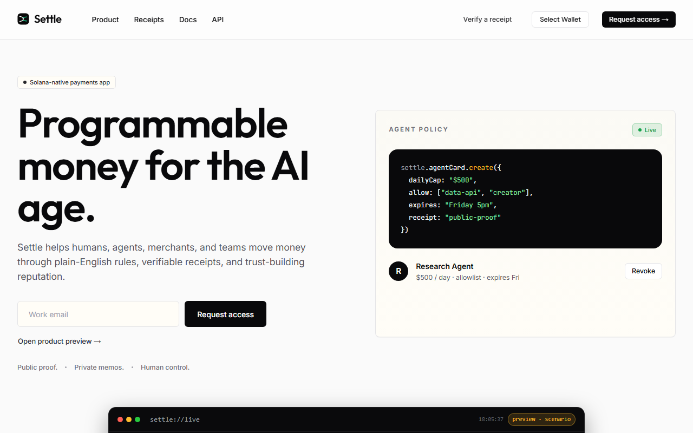
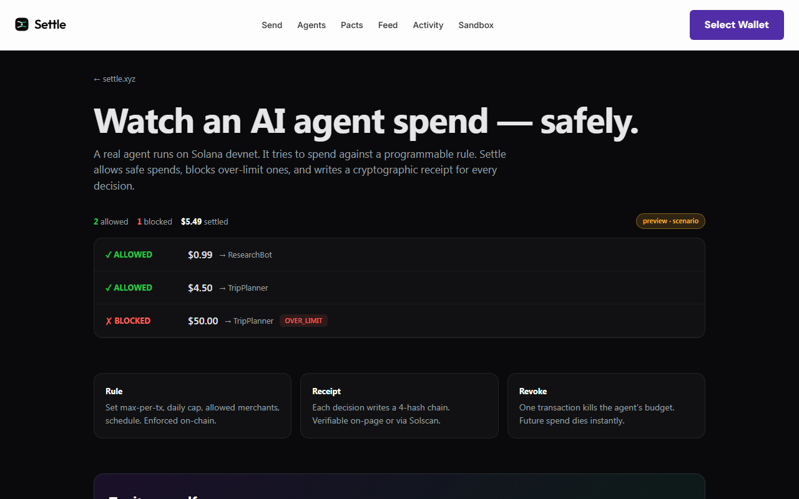
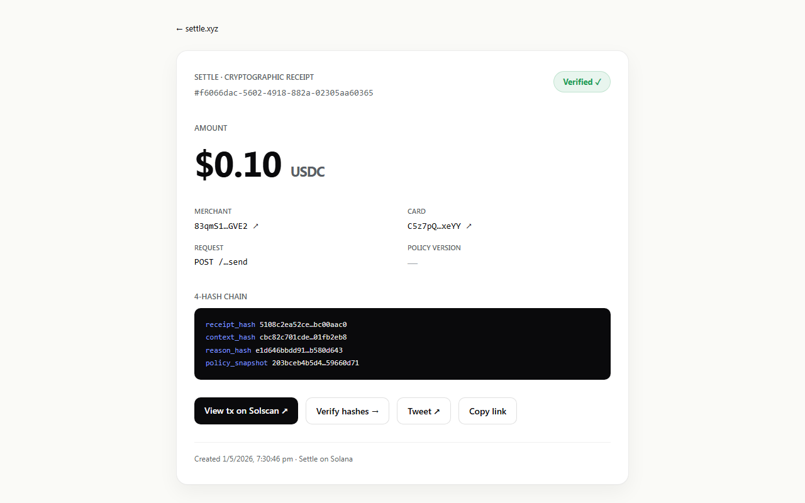
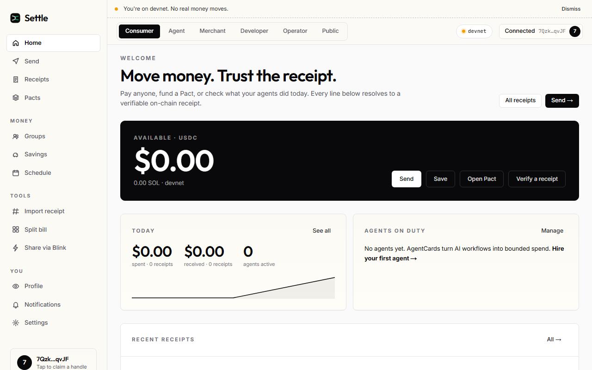
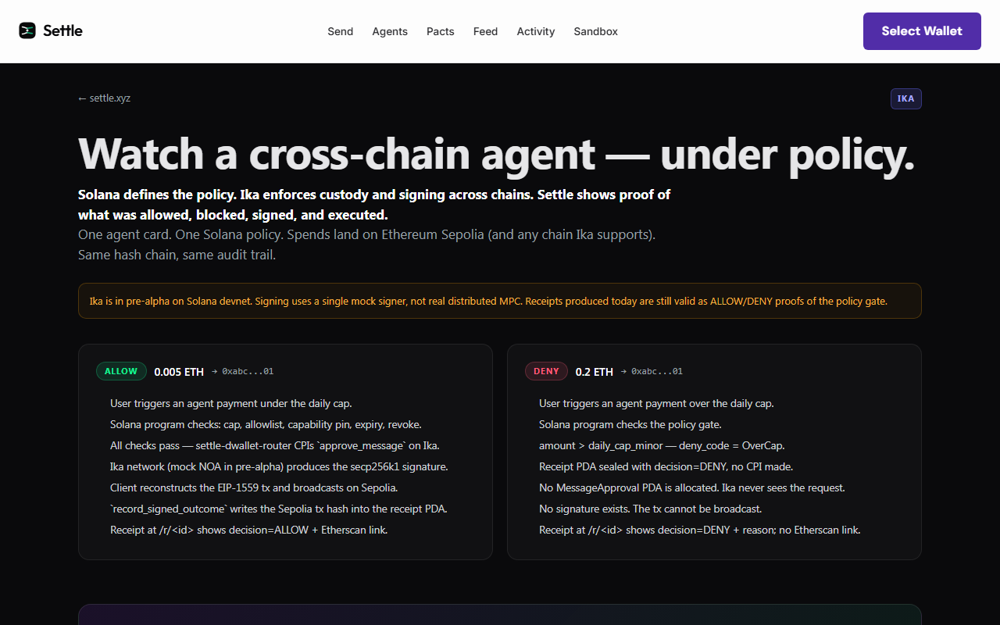
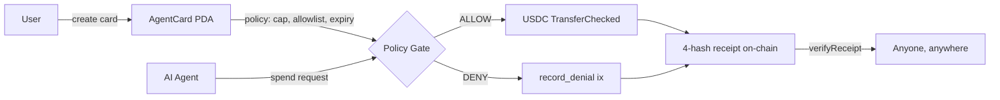

# Settle

**Pay anyone. Hire any AI. Trust the receipts.**

Settle is the payment app for the AI age. Send USDC to anyone with a `@handle`. Hire AI agents to spend on your behalf with cryptographically scoped permissions. Every payment writes a 4-hash chain anyone can verify on-chain — no Settle servers required.

[](./LICENSE)
[](https://solana.com)
[](https://github.com/Pratiikpy/Settle/actions/workflows/ci.yml)
[](https://www.npmjs.com/package/create-settle-merchant)
[](https://pypi.org/project/settle-protocol-sdk/)



---

## Try it in 2 minutes

No install needed. All four work on devnet right now:

1. **Watch an agent spend** → [`/watch`](https://settle.so/watch). A live card on devnet. The terminal streams real ALLOW / DENY decisions; click any row to open the on-chain receipt.
2. **Send a payment** → [`/start/consumer`](https://settle.so/start/consumer). Connect Phantom, take an in-app sandbox airdrop, send to `@alice`. Receipt lands at `/r/<id>` with full hash chain and Solscan link.
3. **Hire your own agent** → [`/start/agent`](https://settle.so/start/agent). Pick a budget. Pick what it can buy. One transaction revokes the credential.
4. **Verify a receipt without us** → grab any `receipt_hash` from `/r/<id>`, drop it into [`/verify`](https://settle.so/verify). The SDK re-derives the hash chain in your browser.

---

## What it looks like

| Watch (`/watch`) | Receipt poster (`/r/<id>`) |
|---|---|
|  |  |
| **Dashboard (`/dashboard`)** | **Cross-chain (`/watch-crosschain`)** |
|  |  |

---

## How a payment flows



Same primitive runs the cross-chain extension: Settle's policy gate evaluates on Solana, [Ika dWallets](https://ika.xyz) produce the signature for the target chain, the hash chain still settles on Solana. See [`docs/IKA-INTEGRATION.md`](docs/IKA-INTEGRATION.md).

---

## 5 lines and you're shipping receipts

```ts
import { kernelCommit, verifyReceipt } from "@settle/sdk";

const result = kernelCommit({
  kind: "x402_spend",
  request_id,
  card_pubkey, agent_pubkey,
  amount_lamports: "5000000",
  capability_hash, /* ...policy snapshot fields */
});

// Server-side: result.hashes go into the on-chain `record_receipt` ix.
// Client-side, anywhere:
const ok = verifyReceipt(canonicalReceipt, result.hashes);
```

The SDK is published in three runtimes:

- **TypeScript:** [`@settle/sdk`](packages/sdk) (workspace-internal) + the helpers `create-settle-merchant`, `@settle-web/web-components` on npm.
- **Python:** [`settle-protocol-sdk`](https://pypi.org/project/settle-protocol-sdk/) — receipt kernel + `verifyReceipt` + LangChain and CrewAI adapters.
- **Rust:** [`packages/rust-sdk`](packages/rust-sdk) for on-chain consumers.

---

## What a receipt looks like

```
SETTLE · CRYPTOGRAPHIC RECEIPT
#5e2c1b3a-9f47-4a01-b8a1-...

  Verified ✓     $5.00 USDC

  MERCHANT     5jK...4h2
  CARD         3xR...8aN
  REQUEST      POST /api/translate
  POLICY       v3

  4-HASH CHAIN
    receipt_hash    a91b...e8d4
    context_hash    7f02...c1a6
    reason_hash     d44c...f902
    policy_snapshot 18ee...bb7c

  View tx on Solscan ↗     Verify hashes →
```

Every receipt — happy path or deny — commits the same four BLAKE3 hashes on Solana. Anyone with the receipt JSON can re-derive them in their browser.

---

## Settle × Ika · cross-chain custody

> Solana defines the policy. Ika enforces custody and signing across chains. Settle shows proof of what was allowed, blocked, signed, and executed.

A sibling Anchor 1.0 program (`programs-ika/settle-dwallet-router`) extends the policy gate to any chain Ika supports. Day-one chain: Ethereum Sepolia.

| Asset | Where | Verifiable |
|---|---|---|
| Router program | `FNpdUSsk9xzrFR1qsDnE17KaAYA95YwGCtiuKbTa7qSK` | [Solscan](https://solscan.io/account/FNpdUSsk9xzrFR1qsDnE17KaAYA95YwGCtiuKbTa7qSK?cluster=devnet) |
| Cross-chain UI | `/start/agent-crosschain`, `/cards/crosschain/<pda>`, `/watch-crosschain` | live |
| Tests | 68 across the integration (15 Rust + 12 SDK + 11 validation + 21 EIP-1559 + 9 Playwright) | all green |

Full integration story: [`docs/IKA-INTEGRATION.md`](docs/IKA-INTEGRATION.md). Test evidence: [`docs/IKA-TEST-REPORT.md`](docs/IKA-TEST-REPORT.md).

---

## How Settle compares

| | Stripe | Helio | x402 raw | **Settle** |
|---|:-:|:-:|:-:|:-:|
| Agent-native credentials | — | — | partial | ✅ |
| On-chain receipts | — | partial | — | ✅ |
| Revocable in one tx | — | — | — | ✅ |
| Sub-cent fees | — | ✅ | ✅ | ✅ |
| Cross-chain signing under one policy | — | — | — | ✅ |

---

## Architecture

One Anchor program (`settle-agent-card`) on Solana, 14 instructions. Hash-committed receipts. USDC mint pinned at create-time. Per-call cap, daily cap, allowlist, capability pin, expiry, and revocation are all enforced atomically in one ix — no off-chain middleware in the trust path.

<details>
<summary><b>Instruction list (14)</b></summary>

`create_card`, `spend`, `spend_via_pact`, `revoke`, `record_denial`, `open_pact`, `close_pact`,
`open_streaming_pact`, `claim_streaming`, `pause_streaming`, `resume_streaming`,
`open_delivery_escrow`, `release_delivery_escrow`, `dispute_delivery_escrow`.

`Pact.mode` is a `PactMode` enum: `OneShot`, `Streaming` (rate-per-slot with pause/resume), or `DeliveryEscrow` (pinned merchant + dispute window + permissionless post-deadline release).

</details>

<details>
<summary><b>Hash-committed receipts</b></summary>

Every `PolicyDecisionEvent` commits 3 × 32-byte BLAKE3 hashes on-chain (`receipt_hash`, `reason_hash`, `policy_snapshot_hash`). The off-chain `purpose_hash` binds them to HTTP context. `@settle/sdk::verifyReceipt` re-derives every hash from the canonical JSON in any environment that can run JS.

</details>

<details>
<summary><b>Solana primitives composed</b></summary>

**On-chain:** Anchor 0.31 · SPL Token + ATA · SPL Memo · Solana Pay · Compressed NFTs (Bubblegum V1) · Address Lookup Tables · Versioned transactions · Lighthouse tx assertions · MPL Core soulbound badges · Light Protocol compressed tokens.

**Off-chain:** Helius RPC + WS · Helius Sender (Jito bundles) · Jupiter Lite (quote + swap) · Pyth Hermes · Photon RPC (compressed accounts) · Solana Attestation Service · Solana Actions / Blinks · VAPID Web Push · jsQR + parseURL.

</details>

<details>
<summary><b>Custody guarantees</b></summary>

- Per-call cap, daily cap (cross-pact via parent card), allowlist, capability pin, expiry, revocation — all checked atomically in one ix → no TOCTOU.
- Slot-based cap window (`CAP_WINDOW_SLOTS = 220_000`, ≈ 24h) cannot be exploited by validator clock manipulation.
- Merchant pubkey **pinned** in the DeliveryEscrow variant payload — permissionless release cannot redirect funds.
- USDC mint pinned at card create — spend rejects any other mint.

</details>

---

## Run locally

```bash
git clone https://github.com/Pratiikpy/Settle
cd Settle
pnpm install
cp .env.example .env.local        # fill: RPC URL, Helius, Supabase, Upstash, sealed-box keys

pnpm dev                          # web + indexer
pnpm anchor:build                 # cd programs/settle-agent-card && anchor build
pnpm test                         # vitest — 83 unit tests on @settle/sdk
```

<details>
<summary><b>One-time setup + environment variables</b></summary>

```bash
pnpm vapid:keygen           # VAPID keypair for Web Push
pnpm seal:keygen            # sealed-box keypair for voice notes
pnpm deploy:devnet          # builds + deploys Anchor program + patches SETTLE_PROGRAM_ID
pnpm seed:supabase          # apply migrations
pnpm seed:demo-card         # seeds a demo agent card + pacts (oneshot/streaming/escrow)
```

| Var | Where to get it |
|---|---|
| `NEXT_PUBLIC_RPC_URL`, `HELIUS_API_KEY` | [helius.dev](https://helius.dev) |
| `NEXT_PUBLIC_SUPABASE_URL` + `_ANON_KEY` + `SUPABASE_SERVICE_ROLE_KEY` | [supabase.com](https://supabase.com) |
| `UPSTASH_REDIS_REST_URL` + `UPSTASH_REDIS_REST_TOKEN` | [upstash.com](https://upstash.com) |
| `SETTLE_SEALED_BOX_PUBKEY` + `_PRIVKEY` | `pnpm seal:keygen` |
| `SETTLE_VAPID_PUBLIC_KEY` + `_PRIVATE_KEY` | `pnpm vapid:keygen` |
| `SETTLE_FACILITATOR_PRIVKEY` | base58 secret — equals `card.agent_pubkey` for proxy-managed cards |
| `SETTLE_ESCROW_CRON_PRIVKEY` | base58 secret — pays tx fees for permissionless release after deadline |
| `SETTLE_AGENT_CARD_PROGRAM_ID` | set after `pnpm deploy:devnet` |

Optional (mainnet hardening): `JUPITER_API_KEY`, `LIGHTHOUSE_PROGRAM_ID`, `SETTLE_SAS_PROGRAM_ID`.

</details>

---

## Repo layout

```
settle-protocol/
├── apps/
│   ├── web/                  Next.js 15 — UI + every API endpoint + x402 proxy
│   ├── indexer/              Helius onLogs WS + webhook worker + escrow-cron
│   ├── demo-merchants/       Sample merchant servers (arxiv-fetch, translate)
│   └── demo-agent/           Sample autonomous agent paying via x402 proxy
├── packages/
│   ├── sdk/                  @settle/sdk — canonical hashing + verifyReceipt + sealed-box
│   ├── types/                Canonical DenyCode enum + ix arg types
│   ├── ui/                   Shared React primitives
│   ├── python-sdk/           settle-protocol-sdk on PyPI
│   ├── rust-sdk/             on-chain consumer SDK
│   ├── create-settle-merchant/   npm scaffold CLI
│   └── web-components/       <settle-pay> + <settle-verify> custom elements
├── programs/settle-agent-card/   Anchor 0.31 — one program, 14 instructions
├── programs-ika/settle-dwallet-router/   Anchor 1.0 — Settle × Ika cross-chain extension
├── infra/supabase/migrations/    schema + RLS + receipt views
└── docs/
    ├── IKA-INTEGRATION.md    Cross-chain integration story
    ├── IKA-TEST-REPORT.md    Test evidence + reproduction commands
    └── PRODUCT_SPEC.md       Full feature decomp + primitive inventory
```

---

## Published packages

| Registry | Package | Use |
|---|---|---|
| npm | [`create-settle-merchant`](https://www.npmjs.com/package/create-settle-merchant) | scaffold a Settle merchant: keypair + webhook secret + capability hash + `.env` template |
| npm | [`@settle-web/web-components`](https://www.npmjs.com/package/@settle-web/web-components) | `<settle-pay>` and `<settle-verify>` custom elements; drop into any HTML page |
| PyPI | [`settle-protocol-sdk`](https://pypi.org/project/settle-protocol-sdk/) | Python receipt kernel + `verifyReceipt` + LangChain + CrewAI adapters |

---

## License

[MIT](./LICENSE). The `@settle/sdk` canonical hashing + `verifyReceipt` modules are public goods for any team building hash-committed audit trails on Solana.

## Security

See [`SECURITY.md`](./SECURITY.md). Audited against [`coral-xyz/sealevel-attacks`](https://github.com/coral-xyz/sealevel-attacks) patterns. Report issues to `xprtqk@gmail.com` with subject `SETTLE SECURITY`.

## Contributing

The TS, Python, and Rust SDKs accept PRs. The on-chain Anchor program is MIT — fork, audit, or build on top.
