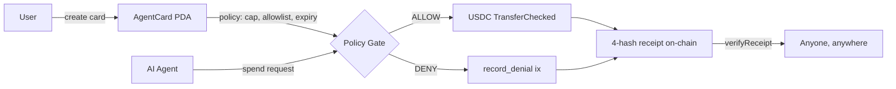

# Settle

## The programmable spending card for AI agents.

**Caps. Allowlists. Expiry. Instant revoke.** Every payment leaves a four-hash receipt on Solana that anyone can re-derive in a browser tab. No Settle server in the trust path; on-chain policy enforcement is independent of our database.

Settle is the trust layer that sits between humans and the AI agents they hand a budget to. It also works for plain consumer USDC sends and merchant accept-payments flows — but the spine is the agent card.

[](./LICENSE)
[](https://solana.com)
[](https://github.com/Pratiikpy/Settle/actions/workflows/ci.yml)
[](https://www.npmjs.com/package/create-settle-merchant)
[](https://pypi.org/project/settle-protocol-sdk/)


**[use-settle.vercel.app](https://use-settle.vercel.app)** · [▶ Watch the 4-min demo](https://youtu.be/UB_qD_q6Kes) · [Verify a receipt](https://use-settle.vercel.app/verify) · Anchor program [`HU4piq8…77nD`](https://solscan.io/account/HU4piq8bwYFast81U6e8huYVb8JaY44chWE8QVGT77nD?cluster=devnet) on devnet

**🏆 Solana Frontier Hackathon submission** — [📊 Pitch deck (PDF)](./docs/Settle-pitch-deck.pdf) · [🧪 Verify everything in 53s](#judge-fastest-path-to-verify-everything) · [📋 PROOF.md](./PROOF.md) · [📖 Session report](./docs/SESSION_REPORT.md) · [🛠 Operator handoff](./docs/OPERATOR_HANDOFF.md)

**In the box:** 2 Anchor programs (settle-agent-card 0.31, settle-dwallet-router 1.0 cross-chain) · 15 instructions on the main program · 4 hashes per receipt · 3 SDK runtimes (TS / Python on PyPI / Rust, byte-identical) · 1 cross-chain extension via [Ika](https://ika.xyz) (Solana → Ethereum Sepolia) · on-chain bytecode verification at [`/verify-build`](https://use-settle.vercel.app/verify-build) · 199 SDK unit tests + Playwright E2E + cross-language parity in CI

**Status:** devnet today · mainnet after audit ([`SECURITY.md`](./SECURITY.md))

---

## Try it in 2 minutes

No install needed. All four work on devnet right now:

1. **Watch an agent spend** → [`/watch`](https://use-settle.vercel.app/watch) — real ALLOW / DENY decisions stream live; click any row to open the on-chain receipt.
2. **Send a payment** → [`/start/consumer`](https://use-settle.vercel.app/start/consumer) — connect Phantom, take a sandbox airdrop, send to `@alice`.
3. **Hire your own agent** → [`/start/agent`](https://use-settle.vercel.app/start/agent) — pick a budget and what it can buy; revoke in one tx.
4. **Verify a receipt without us** → paste `ca50ca04e587acecbfefdab0bfdcee5351a521f33797d201417a9c3a238cc902` into [`/verify`](https://use-settle.vercel.app/verify) — the SDK re-derives all 4 BLAKE3 hashes in your browser tab.

---

## Judge: fastest path to verify everything

```bash
git clone https://github.com/Pratiikpy/Settle.git
cd Settle/apps/web && node e2e/phantom-qa/run-all.mjs
# 12/12 PASS in ~53 seconds against live production
```

That single command exercises every layer in sequence:

- 2-wallet split-bill + 3-wallet group voting (with quorum + double-vote/forge negatives)
- TypeScript SDK + MCP middleware + webhook HMAC + `create-settle-merchant` CLI
- Real on-chain receipt import + `/api/verify/<hash>` roundtrip
- Federation visibility + `/api/preflight` operational diagnostics

**On-chain proofs** (every signature is Solscan-viewable on devnet — see [`PROOF.md`](./PROOF.md)): every Anchor instruction landed end-to-end, including the marquee `spend_via_pact` runtime proof tx [`4ZzgMFwQ…vz6u`](https://solscan.io/tx/4ZzgMFwQQC87E9zxirFj8abogzbVmmZnogXboQGaBYogD9ah5FkKpRo3iQC28wMjAAgdVbnNdChwLnkznDS5vz6u?cluster=devnet) and a real consumer SPL transfer [`2s71RsGr…jNMk`](https://solscan.io/tx/2s71RsGrSML2Qu2eabEbkSg8aeMtHX2E9vhWvSMiM7N8KgGdwuMyMnVuWoBsCsJMRUZ61RWMXpeWUnHtH5kGjNMk?cluster=devnet).

**Click-and-see-VERIFIED-instantly:** [`/r/87d94764-cfdb-43c9-9361-18d00bde66ee`](https://use-settle.vercel.app/r/87d94764-cfdb-43c9-9361-18d00bde66ee) — a real imported receipt rendering with all 4 BLAKE3 hashes ✓ matching, computed client-side in your browser. No Settle server in the trust path.

---

## What it looks like

| Watch (`/watch`) | Receipt poster (`/r/<id>`) |
|---|---|
|  |  |
| **Dashboard (`/dashboard`)** | **Cross-chain (`/watch-crosschain`)** |
|  |  |

---

## How a payment flows



Same primitive runs the cross-chain extension: Settle's policy gate evaluates on Solana, [Ika dWallets](https://ika.xyz) produce the signature for the target chain, the hash chain still settles on Solana. See [`docs/IKA-INTEGRATION.md`](docs/IKA-INTEGRATION.md).

---

## Verify a receipt in five lines

```ts
import { verifyReceipt } from "@settle/sdk";

const v = verifyReceipt({ receipt, reason, policy_snapshot, http, expected });

if (v.ok) console.log("All 4 hashes match — payment is provable.");
else      console.error("Tampering detected:", v.mismatches);
```

`receipt`, `reason`, `policy_snapshot` come from your DB row or the receipt poster JSON. `expected` is the four hashes from on-chain (Solscan or any RPC). `verifyReceipt` is a pure function. It runs in a browser tab, an Edge worker, or a CI pipeline. No Settle service is needed for the verification step; the deployed Anchor program is the only authority you have to trust.

Settle ships SDKs in three runtimes:

- **TypeScript** — [`@settle/sdk`](packages/sdk) (in-monorepo, used by the Settle web app, indexer, and reference agent). Public npm companions: [`create-settle-merchant`](https://www.npmjs.com/package/create-settle-merchant) (scaffold CLI) and [`@settle-web/web-components`](https://www.npmjs.com/package/@settle-web/web-components) (`<settle-pay>` and `<settle-verify>` custom elements).
- **Python** — [`settle-protocol-sdk`](https://pypi.org/project/settle-protocol-sdk/) **published on PyPI**. Includes the receipt kernel, `verifyReceipt`, and adapters for LangChain and CrewAI.
- **Rust** — [`packages/rust-sdk`](packages/rust-sdk) (in-monorepo crate for on-chain consumers and CLI tools).

### Same hashes, three runtimes

```ts
// TypeScript — packages/sdk
import { verifyReceipt } from "@settle/sdk";
const v = verifyReceipt({ receipt, reason, policy_snapshot, http, expected });
// v.ok === true ⇒ all 4 hashes match
```

```python
# Python — pip install settle-protocol-sdk
from settle_sdk import verify_receipt
v = verify_receipt({"receipt": r, "reason": s, "policy_snapshot": p,
                    "http": h, "expected": e})
# v.ok is True ⇒ all 4 hashes match
```

```rust
// Rust — packages/rust-sdk
use settle_sdk::verify_receipt;
let v = verify_receipt(&VerifyInput { receipt, reason, policy_snapshot,
                                      purpose_input, expected });
// v.ok ⇒ all 4 hashes match
```

All three call sites compute the same 4 BLAKE3 hashes from the same canonical-JSON encoding. Cross-language parity is enforced by [`packages/python-sdk/test_kernel_parity.py`](packages/python-sdk/test_kernel_parity.py) and [`test_parity.py`](packages/python-sdk/test_parity.py): the Python suite hashes shared fixtures and compares against precomputed TS + Rust outputs.

#### Run the parity demo yourself

One command runs the receipt kernel in all three SDKs against a locked input and prints the side-by-side hashes:

```bash
pnpm demo:parity
```

```
hash                  TypeScript        Python            Rust              match
─────────────────────────────────────────────────────────────────────────────────
receipt_hash          095a40c24988…     095a40c24988…     095a40c24988…       ✓
reason_hash           320e5f7ee4bd…     320e5f7ee4bd…     320e5f7ee4bd…       ✓
policy_snapshot_hash  203bceb4b5d4…     203bceb4b5d4…     203bceb4b5d4…       ✓
purpose_hash          ac9a1f2e6aad…     ac9a1f2e6aad…     ac9a1f2e6aad…       ✓
context_hash          6bb849195e12…     6bb849195e12…     6bb849195e12…       ✓

✓ All 5 hashes match across TypeScript, Python, and Rust.
```

The same canonical input goes through `packages/sdk` (TypeScript), `packages/python-sdk` (Python, also published on PyPI as `settle-protocol-sdk`), and `packages/rust-sdk` (Rust). Five separate BLAKE3 hashes per receipt, all five identical across runtimes. This is the proof behind the "byte-identical SDK parity" claim and is reproducible by any reviewer in under 60 seconds.

---

## What a receipt looks like

```
SETTLE · CRYPTOGRAPHIC RECEIPT
#5e2c1b3a-9f47-4a01-b8a1-...

  Verified ✓     $5.00 USDC

  MERCHANT     5jK...4h2
  CARD         3xR...8aN
  REQUEST      POST /api/translate
  POLICY       v3

  4-HASH CHAIN
    receipt_hash    a91b...e8d4
    context_hash    7f02...c1a6
    reason_hash     d44c...f902
    policy_snapshot 18ee...bb7c

  View tx on Solscan ↗     Verify hashes →
```

Every receipt — happy path or deny — commits the same four BLAKE3 hashes on Solana. Anyone with the receipt JSON can re-derive them in their browser.

**See a live one:** [`/r/93de12a1-01c1-4fc8-83c0-1bff28f5a870`](https://use-settle.vercel.app/r/93de12a1-01c1-4fc8-83c0-1bff28f5a870) — the same shape, with a real on-chain hash you can paste into [`/verify`](https://use-settle.vercel.app/verify) and watch it match.

---

## Settle × Ika · cross-chain custody

> Solana defines the policy. Ika enforces custody and signing across chains. Settle shows proof of what was allowed, blocked, signed, and executed.

A sibling Anchor 1.0 program (`programs-ika/settle-dwallet-router`) extends the policy gate to any chain Ika supports. Day-one chain: Ethereum Sepolia.

| Asset | Where | Verifiable |
|---|---|---|
| Router program | `FNpdUSsk9xzrFR1qsDnE17KaAYA95YwGCtiuKbTa7qSK` | [Solscan](https://solscan.io/account/FNpdUSsk9xzrFR1qsDnE17KaAYA95YwGCtiuKbTa7qSK?cluster=devnet) |
| Cross-chain UI | `/start/agent-crosschain`, `/cards/crosschain/<pda>`, `/watch-crosschain` | live |
| Tests | 68 across the integration (15 Rust + 12 SDK + 11 validation + 21 EIP-1559 + 9 Playwright) | all green |

Full integration story: [`docs/IKA-INTEGRATION.md`](docs/IKA-INTEGRATION.md). Test evidence: [`docs/IKA-TEST-REPORT.md`](docs/IKA-TEST-REPORT.md).

> **Status note.** The Settle-side router program, policy gate, and EIP-1559 receipt envelope are deployed and unit-tested on devnet (15/15 router tests, 21/21 EIP-1559 tests). Live cross-chain signing through the Ika dWallet network is currently blocked on their pre-alpha gRPC endpoint (NGHTTP2_PROTOCOL_ERROR / ALPN handshake failure across Node and Bun, [`docs/IKA-TEST-REPORT.md`](docs/IKA-TEST-REPORT.md)). The Settle-side architecture is independently verifiable today; the round-trip will go live as Ika promotes to a stable RPC.

---

## What's shipped

A non-exhaustive view of what runs today on devnet:

### On-chain · Solana, Anchor 0.31
- `settle-agent-card` program — 15 instructions, hash-committed receipts, atomic policy enforcement, deployed at [`HU4piq8…77nD`](https://solscan.io/account/HU4piq8bwYFast81U6e8huYVb8JaY44chWE8QVGT77nD?cluster=devnet)
- AgentCard PDA with per-call cap · daily cap · allowlist · capability pin · expiry · revocation — all enforced atomically in one instruction
- Three pact modes — `OneShot`, `Streaming` (rate-per-slot, pause/resume), `DeliveryEscrow` (pinned merchant + dispute window + permissionless post-deadline release)
- USDC mint pinned at create-time · slot-based cap window · TransferChecked-anchored transfers · Lighthouse tx assertions

### Cross-chain · Settle × Ika dWallets
- `settle-dwallet-router` (Anchor 1.0) — Settle's policy gate evaluates on Solana, [Ika dWallets](https://ika.xyz) produce the signature for the target chain, the 4-hash receipt still settles on Solana
- Day-one target chain: Ethereum Sepolia · 68 tests across the integration (Settle-side: all green) · live UI at `/watch-crosschain`
- Live signing round-trip is currently blocked on Ika's pre-alpha gRPC (see status note above); Settle-side architecture is verifiable today

### SDKs · byte-identical hashes across runtimes
- **TypeScript** — [`@settle/sdk`](packages/sdk) in-monorepo, plus public companions on npm: [`create-settle-merchant`](https://www.npmjs.com/package/create-settle-merchant), [`@settle-web/web-components`](https://www.npmjs.com/package/@settle-web/web-components)
- **Python** — [`settle-protocol-sdk`](https://pypi.org/project/settle-protocol-sdk/) **published on PyPI**: kernel + LangChain + CrewAI adapters
- **Rust** — [`packages/rust-sdk`](packages/rust-sdk) in-monorepo crate: on-chain consumer SDK + verifier
- Cross-language parity enforced by shared-fixture parity tests in CI

### Developer surface
- `create-settle-merchant` CLI — scaffolds a merchant in one command (keypair, webhook secret, capability hash, `.env` template)
- `<settle-pay>` and `<settle-verify>` web components on npm — drop into any HTML page
- `/embed/pay` widget — drop into any site, Solana Pay URI under the hood
- Solana Actions / Blinks — pay-with-Settle from a tweet or any Blinks-aware client
- Reference merchant servers (arxiv-fetch, translate); reference autonomous agent paying via x402 proxy

### Consumer + agent surface
- `@handle` resolution · USDC sends · QR sends via Solana Pay · receive page · voice memos at `/send/voice` (sealed-box encrypted, transcribed off-chain)
- Split bills (`/split-bill`), group pacts (`/groups`), wishes (`/wishes`), allowances (`/allowances`), scheduled sends, sandbox playground (`/sandbox`)
- Live `/watch` stream of ALLOW/DENY decisions with one-click on-chain receipt links
- Privacy-preserving `/feed` — senders opt in to publish; everything else stays private by default
- Connected `/dashboard` — agents, cards, receipts, audit log, capabilities, spending tracker
- `/leaderboard` — capability heatmap and merchant federation (live cross-origin capability index)
- `/stats` — live network counters indexed from on-chain receipts
- Receipt poster pages at `/r/<id>` — shareable proof every receipt resolves on-chain
- Merchant pages at `/m/<handle>` — disputes, webhooks, capability declarations

### Operations and trust
- **On-chain bytecode verification at [`/verify-build`](https://use-settle.vercel.app/verify-build)** — exposes the deployed program's bytecode SHA-256, program data address, and upgrade authority from the chain so anyone can rebuild with `cargo build-sbf` and compare
- Real-time indexer over Helius onLogs WebSocket + webhook worker + escrow cron for permissionless post-deadline release
- VAPID Web Push for receipt notifications
- Sealed-box (curve25519) encryption for off-chain purpose strings
- 150+ tests across Anchor program · Vitest unit suites on `@settle/sdk` · cross-language parity · Playwright E2E flows · Ika integration

### Solana primitives composed
**On-chain:** Anchor 0.31 · SPL Token + ATA · SPL Memo · Solana Pay · Compressed NFTs (Bubblegum V1) · Address Lookup Tables · Versioned transactions · Lighthouse tx assertions · MPL Core soulbound badges · Light Protocol compressed tokens.

**Off-chain:** Helius RPC + WebSocket · Helius Sender (priority transaction submission) · Jupiter Lite (quote + swap) · Pyth Hermes · Photon RPC (compressed accounts) · Solana Attestation Service · Solana Actions / Blinks · VAPID Web Push · jsQR + Solana Pay URL parsing.

Eighteen Solana primitives composed under one policy gate. Every decision the gate makes, ALLOW or DENY, commits a hash-anchored receipt anyone can verify in their browser.

---

## How Settle compares

| | Stripe | Helio | [x402 raw](https://github.com/coinbase/x402) | **Settle** |
|---|:-:|:-:|:-:|:-:|
| Agent-native credentials (cap, allowlist, expiry, revocation) | — | — | partial | ✅ |
| On-chain receipts (kernel-committed) | — | partial | — | ✅ |
| Revocable in one tx | — | — | — | ✅ |
| Verifiable without provider servers | — | — | — | ✅ |
| Cross-chain signing under one policy | — | — | — | ✅ |

---

## Architecture

The on-chain core is the `settle-agent-card` Anchor 0.31 program (15 instructions). A sibling program, `settle-dwallet-router` (Anchor 1.0), extends the policy gate cross-chain via Ika. Hash-committed receipts. USDC mint pinned at create-time. Per-call cap, daily cap, allowlist, capability pin, expiry, and revocation are all enforced atomically in one ix, removing the TOCTOU window between policy decision and transfer.

<details>
<summary><b>Instruction list (14)</b></summary>

`create_card`, `spend`, `spend_via_pact`, `revoke`, `record_denial`, `open_pact`, `close_pact`,
`open_streaming_pact`, `claim_streaming`, `pause_streaming`, `resume_streaming`,
`open_delivery_escrow`, `release_delivery_escrow`, `dispute_delivery_escrow`.

`Pact.mode` is a `PactMode` enum: `OneShot`, `Streaming` (rate-per-slot with pause/resume), or `DeliveryEscrow` (pinned merchant + dispute window + permissionless post-deadline release).

</details>

<details>
<summary><b>Hash-committed receipts</b></summary>

Every `PolicyDecisionEvent` commits 3 × 32-byte BLAKE3 hashes on-chain (`receipt_hash`, `reason_hash`, `policy_snapshot_hash`). The off-chain `purpose_hash` binds them to HTTP context. `@settle/sdk::verifyReceipt` re-derives every hash from the canonical JSON in any environment that can run JS.

</details>

### Custody guarantees

- **Atomic checks in one ix.** Per-call cap, daily cap (cross-pact via parent card), allowlist, capability pin, expiry, revocation — all evaluated in the same instruction. No TOCTOU window between policy decision and transfer.
- **Slot-based cap window.** `CAP_WINDOW_SLOTS = 220_000` (~24h) cannot be exploited by validator clock manipulation.
- **Pinned merchant pubkey** in the DeliveryEscrow variant — permissionless release after deadline cannot redirect funds to an attacker.
- **Pinned USDC mint** at card-create time — spend rejects any other token, removing the spoofed-mint class of attack.

### On-chain bytecode verification

[`/verify-build`](https://use-settle.vercel.app/verify-build) exposes the deployed program's bytecode SHA-256, program data address, and upgrade authority straight from the chain. Anyone can rebuild the program with `cargo build-sbf` (or `anchor build --verifiable`) against the source and compare against the on-chain hash to confirm the deployment matches the repo. The committed build-info artifact is regenerated on every clean deploy.

---

## Run locally

```bash
git clone https://github.com/Pratiikpy/Settle
cd Settle
pnpm install
cp .env.example .env.local        # fill: RPC URL, Helius, Supabase, Upstash, sealed-box keys

pnpm dev                          # web + indexer
pnpm anchor:build                 # cd programs/settle-agent-card && anchor build
pnpm test                         # vitest — 199 unit tests on @settle/sdk
```

<details>
<summary><b>One-time setup + environment variables</b></summary>

```bash
pnpm vapid:keygen           # VAPID keypair for Web Push
pnpm seal:keygen            # sealed-box keypair for voice notes
pnpm deploy:devnet          # builds + deploys Anchor program + patches SETTLE_PROGRAM_ID
pnpm seed:supabase          # apply migrations
pnpm seed:demo-card         # seeds a demo agent card + pacts (oneshot/streaming/escrow)
```

| Var | Where to get it |
|---|---|
| `NEXT_PUBLIC_RPC_URL`, `HELIUS_API_KEY` | [helius.dev](https://helius.dev) |
| `NEXT_PUBLIC_SUPABASE_URL` + `_ANON_KEY` + `SUPABASE_SERVICE_ROLE_KEY` | [supabase.com](https://supabase.com) |
| `UPSTASH_REDIS_REST_URL` + `UPSTASH_REDIS_REST_TOKEN` | [upstash.com](https://upstash.com) |
| `SETTLE_SEALED_BOX_PUBKEY` + `_PRIVKEY` | `pnpm seal:keygen` |
| `SETTLE_VAPID_PUBLIC_KEY` + `_PRIVATE_KEY` | `pnpm vapid:keygen` |
| `SETTLE_FACILITATOR_PRIVKEY` | base58 secret — equals `card.agent_pubkey` for proxy-managed cards |
| `SETTLE_ESCROW_CRON_PRIVKEY` | base58 secret — pays tx fees for permissionless release after deadline |
| `SETTLE_AGENT_CARD_PROGRAM_ID` | set after `pnpm deploy:devnet` |

Optional (mainnet hardening): `JUPITER_API_KEY`, `LIGHTHOUSE_PROGRAM_ID`, `SETTLE_SAS_PROGRAM_ID`.

</details>

---

## Repo layout

```
settle-protocol/
├── apps/
│   ├── web/                  Next.js 15 — UI + every API endpoint + x402 proxy
│   ├── indexer/              Helius onLogs WS + webhook worker + escrow-cron
│   ├── demo-merchants/       Reference merchant integrations (arxiv-fetch, translate)
│   └── demo-agent/           Reference autonomous agent paying via x402 proxy
├── packages/
│   ├── sdk/                  @settle/sdk — canonical hashing + verifyReceipt + sealed-box
│   ├── types/                Canonical DenyCode enum + ix arg types
│   ├── ui/                   Shared React primitives
│   ├── python-sdk/           settle-protocol-sdk on PyPI
│   ├── rust-sdk/             on-chain consumer SDK
│   ├── create-settle-merchant/   npm scaffold CLI
│   └── web-components/       <settle-pay> + <settle-verify> custom elements
├── programs/settle-agent-card/   Anchor 0.31, 15 instructions (receipt kernel)
├── programs-ika/settle-dwallet-router/   Anchor 1.0 — Settle × Ika cross-chain extension
├── infra/supabase/migrations/    schema + RLS + receipt views
└── docs/
    ├── IKA-INTEGRATION.md    Cross-chain integration story
    ├── IKA-TEST-REPORT.md    Test evidence + reproduction commands
    └── PRODUCT_SPEC.md       Full feature decomp + primitive inventory
```

---

## Published packages

| Registry | Package | Use |
|---|---|---|
| npm | [`create-settle-merchant`](https://www.npmjs.com/package/create-settle-merchant) | scaffold a Settle merchant: keypair + webhook secret + capability hash + `.env` template |
| npm | [`@settle-web/web-components`](https://www.npmjs.com/package/@settle-web/web-components) | `<settle-pay>` and `<settle-verify>` custom elements; drop into any HTML page |
| PyPI | [`settle-protocol-sdk`](https://pypi.org/project/settle-protocol-sdk/) | Python receipt kernel + `verifyReceipt` + LangChain + CrewAI adapters |

---

## License

[MIT](./LICENSE). The `@settle/sdk` canonical hashing + `verifyReceipt` modules are public goods for any team building hash-committed audit trails on Solana.

## Security

See [`SECURITY.md`](./SECURITY.md). Audited against [`coral-xyz/sealevel-attacks`](https://github.com/coral-xyz/sealevel-attacks) patterns. Report issues to `xprtqk@gmail.com` with subject `SETTLE SECURITY`.

## Contributing

The TS, Python, and Rust SDKs accept PRs. The on-chain Anchor program is MIT — fork, audit, or build on top.
